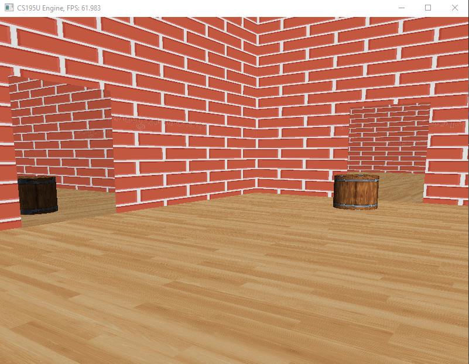

Moving the mouse pans the camera,
pressing wasd keys moves the player.

My main implimentation for the final was to 
add portals! They are able to show what you 
would see if there was an actual portal to a 
different location in space.

     
     <!--  -->

     
